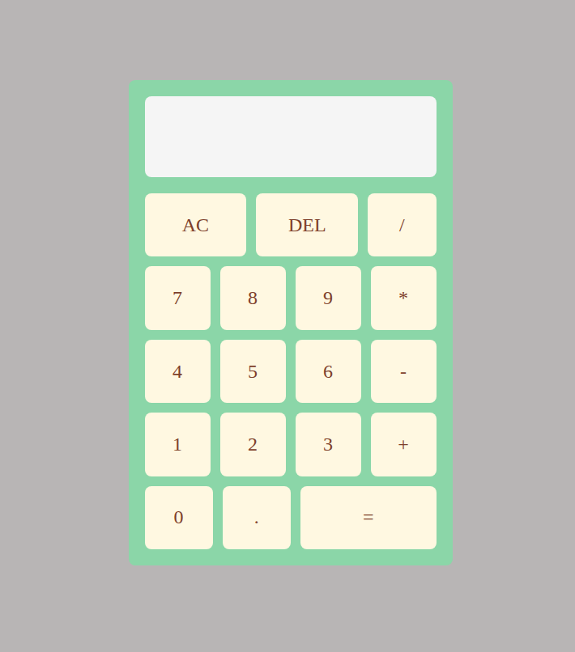

# Calculator

A simple web-based calculator built with JavaScript, HTML, and CSS. This project is my capstone project for front end development, demonstrating basic DOM manipulation, event handling, and arithmetic operations.

## Features

- Addition, subtraction, multiplication, and division
- Clear and delete functionality
- Responsive design for desktop and mobile

## Usage

1. Clone or download the repository.
2. Open `index.html` in your browser.
3. Use the calculator by clicking the buttons or using your keyboard (if supported).

## Screenshot

## Getting Started

No installation required. Just open the HTML file in your browser.
